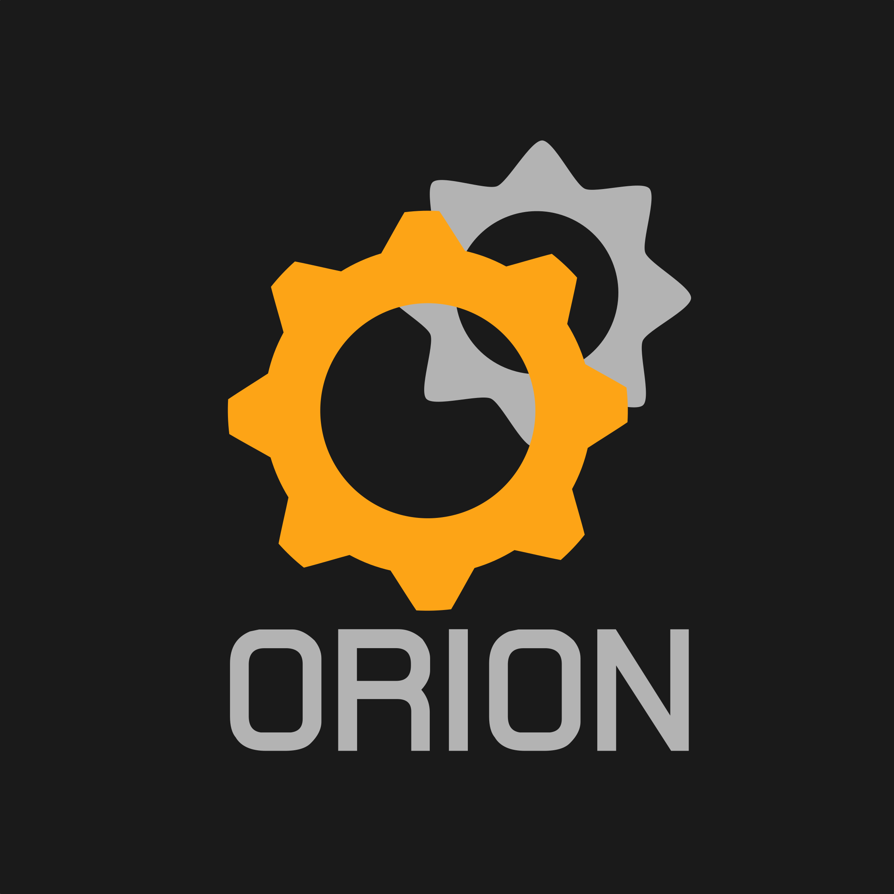

<!-- LOGO -->

<p align="center">
  
</p>

<!-- TEAM PHOTO -->

<p align="center">
  
</p>

---

---

# **Orion VI – Mars Rover Project (ERC 2026)**


This repository contains the complete technical resources for the **Orion VI Mars Rover**, developed by the **Microchip Scientific Student Association** at **Lublin University of Technology**, Faculty of Electrical Engineering, **Department of Electronics and Information Technology**.

We are currently designing a modular Mars rover and an autonomous drone for the **European Rover Challenge 2026**.

---

## 🚀 **About the Project**

In this repository, you will find:

### **📘 Documentation**

Complete documentation of the Orion VI rover and all subsystem details.

### **💻 Rover Software**

Software for:

* on-board control and decision systems
* navigation and autonomy
* communication and telemetry
* ground station tools
  Each folder includes a README with the **module author** listed at the top.

### **🛠️ Mechanics**

CAD models, assemblies, structural design, and mechanical analysis.

### **🔌 Electronics**

Electronic schematics, PCB designs, firmware, and subsystem architecture.

---

## 👥 **Team Structure**

### **Supervisors**

* **Scientific Supervisor:** *Marcin MAciejewski*
* **President of the Student Association:** *Matvii Aksenko*
* **Vice President:** *Mateusz Kowalik*

### **Technical Leads**

* **Software Lead:** *Jan Kwapiński*
* **Electronics Lead:** *Piotr Królik*
* **Mechanics Lead:** *Bartek Kucio*
* **Drone Lead:** *Szymon Rybka*

*(Replace placeholder names with the real ones.)*

---

## 📂 **Repository Structure**

```
/docs               – project documentation
/software           – rover and drone software + module descriptions
/mechanics          – CAD, assemblies, mechanical analysis
/electronics        – schematics, PCB, firmware
/drone              – autonomous drone development
```

---

## 📞 **Contact**

Follow us and stay updated:

* **Facebook:** *https://www.facebook.com/orion.pollub*
* **Instagram:** *https://www.instagram.com/projekt.orion/*

---

If you want, I can:
✓ add clickable badges,
✓ prepare a better header layout,
✓ generate a nicer, more stylized README with colors and sections.
